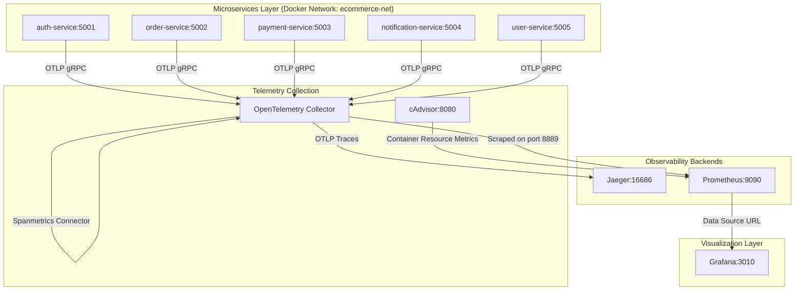

# Observability Stack: Implementation Walkthrough

This document outlines the detailed architecture, configuration files, and verified metrics queries implemented for the **ShopPOC** microservices application. This setup forms the foundation of your research project metrics collection and visualization.

---

## 1. System Architecture

The implemented observability pipeline routes telemetry data from the microservices and container runtime:



---

## 2. Updated Configuration Files

Below are the complete, functional configuration files that have been integrated and verified in the project workspace:

### 2.1. OpenTelemetry Collector Configuration
`observability/otel-collector-config.yaml`
```yaml
receivers:
  otlp:
    protocols:
      grpc:
        endpoint: 0.0.0.0:4317
      http:
        endpoint: 0.0.0.0:4318

exporters:
  debug:
  otlp/jaeger:
    endpoint: jaeger:4317
    tls:
      insecure: true
  prometheus:
    endpoint: 0.0.0.0:8889
    namespace: "otel"

connectors:
  spanmetrics:
    histogram:
      explicit:
        buckets: [100us, 1ms, 2ms, 6ms, 10ms, 100ms, 250ms]
      unit: "ms"
    dimensions:
      - name: http.status_code
      - name: http.method
      - name: http.route

processors:
  batch:

service:
  pipelines:
    traces:
      receivers: [otlp]
      processors: [batch]
      exporters: [otlp/jaeger, spanmetrics]
    metrics:
      receivers: [otlp, spanmetrics]
      processors: [batch]
      exporters: [prometheus]
```

### 2.2. Prometheus Scraper Configuration
`observability/prometheus.yml`
```yaml
global:
  scrape_interval: 15s
  evaluation_interval: 15s

scrape_configs:
  - job_name: 'prometheus'
    scrape_interval: 5s
    static_configs:
      - targets: ['localhost:9090']

  - job_name: 'otel-collector'
    scrape_interval: 5s
    static_configs:
      - targets: ['otel-collector:8889']

  - job_name: 'cadvisor'
    scrape_interval: 5s
    static_configs:
      - targets: ['cadvisor:8080']
```

### 2.3. Docker Compose Configuration
`docker-compose.yml` (Highlights of the new/updated services)
```yaml
  otel-collector:
    image: otel/opentelemetry-collector-contrib:latest
    container_name: otel-collector
    command: ["--config=/etc/otelcol/config.yaml"]
    volumes:
      - ./observability/otel-collector-config.yaml:/etc/otelcol/config.yaml
    ports:
      - "4319:4317"
      - "4320:4318"
      - "8889:8889"
    depends_on:
      - jaeger
    networks:
      - ecommerce-net
    restart: unless-stopped

  prometheus:
    image: prom/prometheus:latest
    container_name: prometheus
    command:
      - '--config.file=/etc/prometheus/prometheus.yml'
      - '--storage.tsdb.path=/prometheus'
      - '--web.console.libraries=/usr/share/prometheus/console_libraries'
      - '--web.console.templates=/usr/share/prometheus/consoles'
    volumes:
      - ./observability/prometheus.yml:/etc/prometheus/prometheus.yml
    ports:
      - "9090:9090"
    depends_on:
      - otel-collector
    networks:
      - ecommerce-net
    restart: unless-stopped

  grafana:
    image: grafana/grafana:latest
    container_name: grafana
    ports:
      - "3010:3000"
    volumes:
      - grafana-storage:/var/lib/grafana
      - ./observability/grafana/provisioning:/etc/grafana/provisioning
    depends_on:
      - prometheus
    networks:
      - ecommerce-net
    restart: unless-stopped

  cadvisor:
    image: gcr.io/cadvisor/cadvisor:v0.47.0
    container_name: cadvisor
    privileged: true
    volumes:
      - /:/rootfs:ro
      - /var/run:/var/run:ro
      - /sys:/sys:ro
      - /var:/var:ro
      - /dev/disk/:/dev/disk:ro
    entrypoint:
      - /bin/sh
      - -c
      - |
        if [ -d "/var/snap/docker/common/var-lib-docker" ] && [ "$$(ls -A /var/snap/docker/common/var-lib-docker 2>/dev/null)" ]; then
          echo "Detected Snap Docker root directory. Running cAdvisor with snap path..."
          exec /usr/bin/cadvisor --docker_root=/var/snap/docker/common/var-lib-docker "$$@"
        else
          echo "Detected standard Docker root directory. Running cAdvisor with standard path..."
          exec /usr/bin/cadvisor --docker_root=/var/lib/docker "$$@"
        fi
    ports:
      - "8080:8080"
    networks:
      - ecommerce-net
    restart: unless-stopped
```

> [!NOTE]
> The cAdvisor service is configured to automatically support both standard Docker (`/var/lib/docker`) and Snap-based Docker (`/var/snap/docker/...`) installations. It mounts the parent `/var` directory (`/var:/var:ro`) to avoid container startup failures on hosts with read-only root filesystems (where missing directories cannot be automatically created on the host). The entrypoint shell script automatically detects which directory is populated on the host, passing the appropriate `--docker_root` argument to cAdvisor. This allows the exact same Docker Compose file to be run on any host without modification.

---

## 3. Verified Prometheus Metrics & Dashboard Queries

To support the three provisioned Grafana dashboards, the following queries have been successfully verified on your running Prometheus instance:

### 3.1. Microservices Metrics (via OpenTelemetry spanmetrics connector)
* **Metric Name**: `otel_traces_span_metrics_calls_total`
* **Throughput (Requests/sec)**:
  ```promql
  sum(rate(otel_traces_span_metrics_calls_total[1m])) by (service_name)
  ```
* **Total Spans Generated (Last 15 minutes)**:
  ```promql
  sum(increase(otel_traces_span_metrics_calls_total[15m]))
  ```
* **Average Latency Trend (ms)**:
  ```promql
  sum(rate(otel_traces_span_metrics_duration_milliseconds_sum[1m])) by (service_name) / sum(rate(otel_traces_span_metrics_duration_milliseconds_count[1m])) by (service_name)
  ```

### 3.2. Container Utilization Metrics (via cAdvisor)
* **CPU Usage (%) per Service**:
  ```promql
  sum(label_replace(label_replace((rate(container_cpu_usage_seconds_total{container_label_com_docker_compose_service=~"auth-service|order-service|payment-service|notification-service|user-service"}[1m])) or (rate(container_cpu_usage_seconds_total{container=~"auth-service|order-service|payment-service|notification-service|user-service"}[1m])), "service", "$1", "container_label_com_docker_compose_service", "(.+)"), "service", "$1", "container", "(.+)")) by (service) * 100
  ```
* **Memory Usage per Service**:
  ```promql
  sum(label_replace(label_replace((container_memory_usage_bytes{container_label_com_docker_compose_service=~"auth-service|order-service|payment-service|notification-service|user-service"}) or (container_memory_usage_bytes{container=~"auth-service|order-service|payment-service|notification-service|user-service"}), "service", "$1", "container_label_com_docker_compose_service", "(.+)"), "service", "$1", "container", "(.+)")) by (service)
  ```
* **Total Network Throughput (RX + TX Bps)**:
  ```promql
  sum(label_replace(label_replace((rate(container_network_receive_bytes_total{container_label_com_docker_compose_service=~"auth-service|order-service|payment-service|notification-service|user-service"}[1m])) or (rate(container_network_receive_bytes_total{container=~"auth-service|order-service|payment-service|notification-service|user-service"}[1m])), "service", "$1", "container_label_com_docker_compose_service", "(.+)"), "service", "$1", "container", "(.+)") + label_replace(label_replace((rate(container_network_transmit_bytes_total{container_label_com_docker_compose_service=~"auth-service|order-service|payment-service|notification-service|user-service"}[1m])) or (rate(container_network_transmit_bytes_total{container=~"auth-service|order-service|payment-service|notification-service|user-service"}[1m])), "service", "$1", "container_label_com_docker_compose_service", "(.+)"), "service", "$1", "container", "(.+)")) by (service)
  ```

---

## 4. Run & Verification Guide

### 4.1. Run Command
To build and spin up the complete microservices and observability pipeline, run:
```bash
docker compose up -d --build
```

### 4.2. Verify the Observability Suite

| Target Component | Address | Description / Verification Step |
|---|---|---|
| **Microservices App** | [http://localhost:3000](http://localhost:3000) | Open the app, log in using `demo` / `demo123`, and perform actions to generate traces. |
| **Jaeger UI** | [http://localhost:16686](http://localhost:16686) | Select a service (e.g., `auth-service`, `order-service`, `payment-service`) in the **Service** dropdown and click **Find Traces** to view propagated distributed spans. |
| **Prometheus UI** | [http://localhost:9090](http://localhost:9090) | Navigate to Status → Targets. Confirm that all three scrape targets are reporting `UP`. |
| **Grafana UI** | [http://localhost:3010](http://localhost:3010) | Access the UI (admin/admin). Confirm the **Prometheus** datasource is connected under connections, and locate the dashboards under the **MSc Observability** folder. |

### 4.3. Automated Traffic Generation
A helper traffic generator is available in the workspace to automatically generate high-volume distributed traces and metrics:
```bash
./generate_traffic.sh
```
This script runs in a loop, logging in, checkout out cart, making charges, sending notifications, and checking user order history. Run this in a separate terminal before taking screenshots for your thesis to populate Grafana with dynamic metrics.
